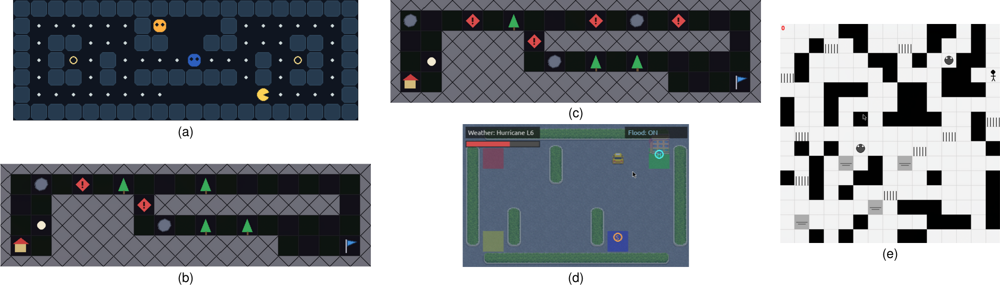

# NPC Gym

NPC Gym (Normative Player Characters Gym) is a lightweight Python library for implementing and evaluating normative
reinforcement-learning agents in Gymnasium environments. It provides Taxi, Merchant, Gardener, and Pacman tasks, typed
transition labels, stateful monitors, an environment-neutral evaluator, tabular Q-learning, and optional
Stable-Baselines3 and Optuna adapters.



## Installation

NPC Gym supports Python 3.11 through 3.13. From a checkout, install the core library with:

```bash
python -m pip install .
```

Optional extras are `asp`, `ltlf`, `render`, `sb3`, `optuna`, and `plots`; contributor extras are `test`, `dev`, and `docs`:

```bash
python -m pip install '.[render,sb3]'
```

To generate monitors from LTLf formulas, install the optional compiler and
[MONA](https://www.brics.dk/mona/download.html) (for example, `sudo apt-get install mona` on Debian/Ubuntu):

```bash
python -m pip install '.[ltlf]'
```

The built-in monitors and the regex compiler use only core dependencies. See the
[monitor specification reference](docs/monitor_specifications.rst) for regex and LTLf construction.
`shell.nix` supplies MONA; Conda users must install the executable separately.

For ASP-based [policy fixing](docs/policy_fixes.rst), install `python -m pip install '.[asp]'`.
This extra supplies Clingo; core imports and monitoring do not require it.

For a complete Conda development environment:

```bash
conda env create -n npcgym -f environment.yml
conda activate npcgym
```

## Quick start

Importing `npc_gym` registers five namespaced Gymnasium environments. Every reset and transition reports normative
labels in `info["labels"]`.

```python
import gymnasium as gym
import npc_gym

env = gym.make("npc_gym/StormTaxi-v0")
observation, info = env.reset(seed=0)
observation, reward, terminated, truncated, info = env.step(0)
print(info["labels"])
env.close()
```

The [environment reference](docs/environments.rst) lists the registered tasks, their parameters, and their labels.
For graphical rendering, install the `render` extra and choose a mode when creating the environment, for example
`gym.make("npc_gym/Pacman-v1", render_mode="human")`. Human frames appear during reset and step.

## A custom monitor

A monitor answers whether an event occurred on the current input and accumulates its count.
A `SimpleMonitor` detects an event; a `ComplexMonitor` combines events with `&`, `|`, and `~`;
a `MultiMonitor` keeps named counts and optional derived totals. Monitoring measures behavior without changing rewards.
Use a [restraining bolt](docs/restraining_bolts.rst) to attach a reward or penalty to a rule.

The following example counts rainy steps without a warning. The factory creates a fresh monitor for evaluation:

```python
import gymnasium as gym
import npc_gym
from npc_gym.evaluation import evaluate
from npc_gym.envs.taxi.labels import TaxiActionLabel, TaxiWeatherLabel
from npc_gym.monitors.regex import from_regex


def rain_without_warning():
    return from_regex(
        ".*[rain & !warn]",
        propositions={
            "rain": lambda inp: TaxiWeatherLabel.RAIN in inp.labels,
            "warn": lambda inp: TaxiActionLabel.WARN in inp.labels,
        },
        consume_initial=False,
    )


env = gym.make("npc_gym/StormTaxi-v0", max_episode_steps=100)
try:
    summary = evaluate(
        env, lambda obs, info: next(i for i, allowed in enumerate(info["action_mask"]) if allowed),
        monitors={"rain_without_warning": rain_without_warning}, seed=0,
    )
    print(summary.mean_monitor_counts)
finally:
    env.close()
```

## Documentation

- [Environments](docs/environments.rst): parameters, spaces, rewards, episode boundaries, labels, norms, and citations.
- [Labeling functions](docs/labeling_functions.rst): describe what happened in a reset or step.
- [Monitors](docs/monitors.rst): count events, combine rules, and collect results; examples and contracts.
- [Monitor specifications](docs/monitor_specifications.rst): regex syntax, LTLf construction, and compiler options.
- [Restraining bolts](docs/restraining_bolts.rst): rewards, recipe overrides, and augmented observations.
- [Policy fixes](docs/policy_fixes.rst): optional ASP planning, objectives, and action selection.
- [Monitor catalogue](docs/monitor_catalogue.rst): shipped rules and their identifiers.
- [Evaluation](docs/evaluation.rst): policies, summaries, metrics, and versioned writers.
- [Integrations](docs/integrations.rst): Stable-Baselines3 and Optuna adapters.
- [Experiments](docs/experiments.rst): the import-safe paper runner and output model.
- [Standalone examples](docs/examples.rst) and the [public API](docs/api.rst). Examples default to full training;
  use `tox -e examples` for small execution checks.
- [Third-party notices](THIRD_PARTY_NOTICES.md): external sources and applicable notices.

A license for NPC Gym will be added upon publication.

Run the fast test suite with `python -m pytest -q`, or the default isolated quality gates with `tox`.
The `ltlf` gate requires MONA and checks finite-trace semantics, regex equivalence, and installed-wheel compilation.
For the paper dataset, start with [reproduction setup and commands](docs/experiments.rst#paper-results).
The pinned `environment-paper.yml` reproduces the recorded training dependency versions;
retained measurements can be analyzed without training or checkpoints.
